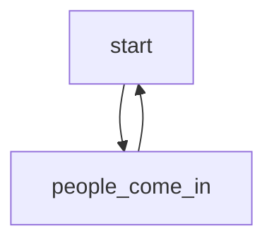

|This|is|a|table|
|---|---|---|---|

---
>This is a comment

---
<h5>nothing here </h5>

---
```python
import somthing as sth
#This is a codeblock
```
---
~~Oh~~ **common** _dear_

---
Only ==22== people

---
1. First
2. Second
a. _The second first_
b. The second second
3. Third

---
- [ ] not done
- [x] done

---
Definition
: X^2^ + H~2~O

---
